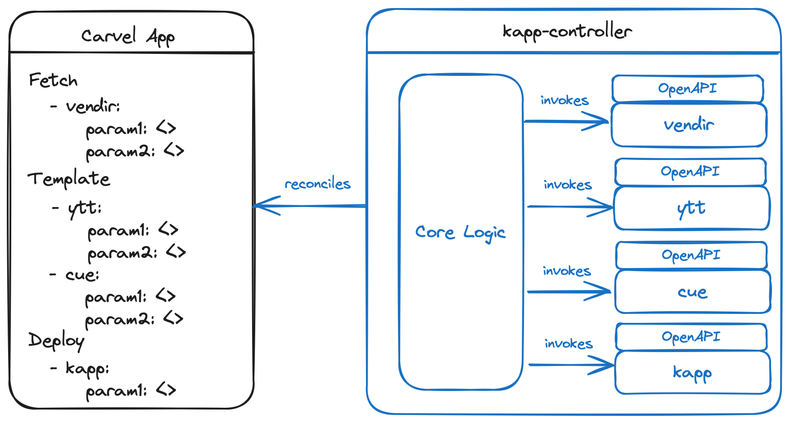

# Introducing Package Functions

## Problem Statement

One of the strenghts of the Carvel project is that it follows the Linux philosophy and provides purposely-built tools that are focused on doing one thing and can be used by themselves, integrated with other Carvel tools, or whatever other tools are out there. The kapp-controller project showcases the benefits of piping all Carvel tools together, while also at the same time allowing integration with other tools in the cloud native ecosystem.

The logic that provides the foundation for kapp-controller is centered around three main _stages_ executed in sequence: `fetch`, `template`, `deploy`. Each of this stage is backed by a _pipeline_ that implements the stage by executing commands with one or more of the tools supported by kapp-controller.

* The `fetch` pipeline is composed by one step and is implemented using Carvel vendir.
* The `template` pipeline is composed by one or more steps in sequence, with each step using one of the supported configuration tools (Carvel ytt, Carvel kbld, Helm, SOPS, CUE).
* The `deploy` pipeline is composed by one step and is implemented using Carvel kapp.



As the cloud native ecosystem evolves and kapp-controller gets wider adoption in the community, new requirements might arise for extending one of the three stages to support new tools or strategies. For example, the project received a few requests to be able to fetch code from a Flux `GitRepository` resource rather than using vendir in the `fetch` stage (see https://github.com/carvel-dev/kapp-controller/issues/1335, https://github.com/carvel-dev/kapp-controller/issues/1048, and https://github.com/carvel-dev/ytt/issues/802) as well as general extension to the current vendir implementation (see https://github.com/carvel-dev/kapp-controller/issues/1263, https://github.com/carvel-dev/kapp-controller/issues/1055, and https://github.com/carvel-dev/kapp-controller/issues/1078). There have also been requests to be able to extend the actions associated with the `deploy` stage (see https://github.com/carvel-dev/kapp-controller/issues/522 and https://github.com/carvel-dev/kapp-controller/issues/1412). Currently, there is work in progress to extend the `template` stage to support configuring Operator Lifecycle Manager bundles (see https://github.com/carvel-dev/kapp-controller/issues/1369). Tomorrow, there could be a request for supporting other tools. There is also a dedicated issue asking for kapp-controller to be more extensible (https://github.com/carvel-dev/kapp-controller/issues/1413).

This need for extensibility is not specific to Carvel kapp-controller, but it's actually a common thing in the CNCF space, whenever a tool gains a wider user base. There are different aspects to consider:

* _Maintenability_. As more tools are added to kapp-controller, the maintenance cost increases. The evolution capabilities and speed of the project are also affected, considering that more integrations require updates, testing, and bug fixing. There are also aspects related to the API schemas and their evolution, made more complicated by an increasing number of integrations. Contributions from the community might become less straightforward to manage, if they are specific to a certain integration. Finally, the release lifecycle of kapp-controller becomes more and more coupled with the release lifecycles of all the single tools integrated within the project.
* _Extensibility_. Being able to integrate kapp-controller with other CNCF project is certainly a great property for a cloud native project, especially considering the current plan to apply for Incubation. Currently, the process for doing that is not immediate, and for a good reason. Changing the APIs of Carvel kapp-controller and adding more dependencies to the project certainly deserve careful evaluation and analysis, considering security, maintenability, and evolution. 
* _Scalability_. Depending on the size of a kapp-controller installation in terms of packages/apps and the number of tools used in a pipeline, there might be issues in scaling the solution.
* _Operations_. As integrated tools increase, it also increases the operational costs for deploying new versions of kapp-controller whenever a new security vulnerability is found for any of the tools included in kapp-controller. The impact radius of the update is wide (higher risk) and the operational cost is high, even though only one tool needs the patch.

This document focuses on a strategy aimed at solving some of those issues.

## Terminology / Concepts

* _Stage_. Each of the main operations performed by kapp-controller for a package/application: `fetch`, `template`, `deploy`.
* _Pipeline_. Implementation of a stage, composed of one or multiple steps. For example, the `template` stage could be implemented by the following pipeline: `helmTemplate | ytt | kbld`.
* _Step_. A single action in a pipeline. For example, `vendir` or `cue`.

## Proposal

### Goals and Non-goals

**Goals:**
- Improve extensibility of kapp-controller.
- Enable more integrations with other CNCF projects.
- Reduce the maintenance burden on the core kapp-controller project.

**Non-Goals**
- Integrate more tools with kapp-controller than what already available.

### Specification / Use Cases

The solution described in this document proposes to decouple the kapp-controller logic from the specific tools used in a stage by introducing _package functions_. Carvel tools will be plugged in as package functions and invoked over gRPC. Additional tools can follow the same approach.


Such an approach follows the same Linux philosophy adopted by other Carvel tools, extending their interoperability properties to the kapp-controller ecosystem as well.

The idea for this architecture is inspired by how other cloud native projects achieved the goals identified in the previous section.

* The [Crossplane](https://www.crossplane.io) project has recently introduced the concept of [_Composite Functions_](https://docs.crossplane.io/latest/concepts/composition-functions/), making it possible to use your favorite templating/configuration tool rather than having to implement the functionality in the core Crossplane logic. For example, using this new architecture, it will be possible to build a function to use ytt for templating Crossplane Compositions without any need for changing the Crossplane code.
* Another source of inspiration is the [MetaController](https://metacontroller.github.io/metacontroller/) project, which relies on a function-based approach for making it easy to build custom Kubernetes controllers.

#### Package Functions

A Package Function would be represented in a cluster as a new CRD. An example could be the following.

```yaml
apiVersion: data.packaging.carvel.dev/v1alpha1
kind: PackageFunction
metadata:
  name: my-super-function
spec:
  function: ghcr.io/kadras-io/my-super-function:0.4.2
  optionsSchema:
    openAPIv3:
      additionalProperties: false
      properties:
        important-params:
          additionalProperties: false
          description: My important params.
          properties:
            param1:
              default: medium
              description: The intensity of param1. Valid options are `low`, `medium`, and `high`.
              type: string
          type: object
      type: object
```

The function referenced by the Package Function custom resource could be implemented using any programming language, as long as API compliance is respected. A Carvel Function SDK would be provided for GOLANG to simplify the development of new functions. Function invocations would happen via gRPC, meaning that each function would be deployed as a gRPC server.

Each stage would be associated with its own Function API. For example, the Function API for the `template` stage would represent the YAML-in, YAML-out strategy.

Each function can accept options that need to be specified using OpenAPI included in the custom resource definition for that function. The `kctrl` CLI could be extended to support the development and release workflows for Package Functions.

#### Pipeline Steps via Functions

This is an example of a Package using a pipeline based on Functions. Each Stage is composed of Functions. Each Step contains Function reference and options.

```yaml
apiVersion: data.packaging.carvel.dev/v1alpha1
kind: Package
metadata:
  creationTimestamp: null
  name: service-binding.packages.kadras.io.0.7.0
spec:
  licenses:
  - Apache 2.0
  refName: service-binding.packages.kadras.io
  releaseNotes: https://github.com/kadras-io/package-for-service-binding/releases
  releasedAt: "2024-02-26T21:32:16Z"
  template:
    spec:
      
      deploy:
      - function:
          ref: kapp
          options: {}

      fetch:
      - function:
          ref: vendir
          options:
            imgpkgBundle:
              image: ghcr.io/kadras-io/package-for-service-binding@sha256:83230a161c772fb65eef79cae4d04e346c75a817ab19a1e0bf7c10a41090b3f5
      
      template:
      - function:
          ref: ytt
          options:
            paths:
            - config
      - function:
          ref: kbld
          options:
            paths:
            - '-'
            - .imgpkg/images.yml

  valuesSchema:
    openAPIv3: {}
  version: 0.7.0
```

#### Backward Compatibility

The current APIs used in each Stage would be deprecated, but will not be removed to ensure backward compatibility. A migration plan should be defined to help users adopt Package Functions. An intermediate step could be to maintain the current APIs, but change the underlying implementations to use Package Functions.

To help users migrate their manifests, we could make some scripts to perform the operation automatically. It's worth considering using [OpenRewrite](https://docs.openrewrite.org) for this purpose. A Recipe can be defined to update all existing Carvel manifests to the new APIs in a programmatic and safe way.

#### Distribution of Package Functions

Package Functions would be imgpkg bundles that include a reference to the function OCI artifact, the OpenAPI schema for the function options, and deployment configuration (for kbld and kapp).

It's worth considering introducing a "carvel-community" or "carvel-contrib" repo under the Carvel GitHub Organization for functions contributed by the community.

### Other Approaches Considered

An alternative approach would be to keep the Carvel tools natively inside kapp-controller, and use package functions only for the other integrations. But that would require two different processes for maintenance, further development, and operations.


Finally, we could continue with the current solution, where APIs and implementation must change whenever a new integration is approved.

## References

* [Metacontroller](https://metacontroller.github.io/metacontroller/)
* [Crossplane Functions](https://docs.crossplane.io/latest/concepts/composition-functions/)

## Open Questions

_Add questions here_

## Answered Questions

_Add answers here_
